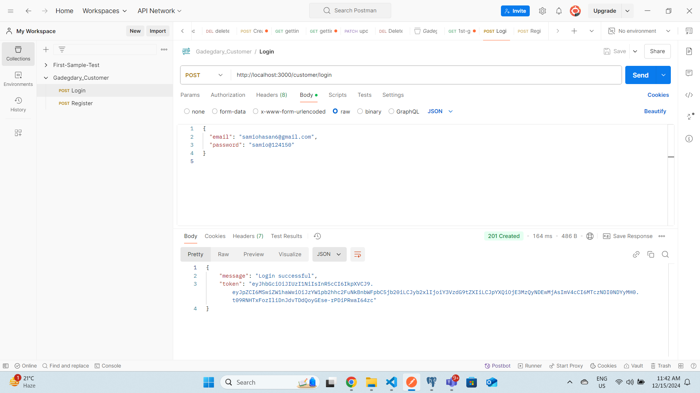

<p align="center">
  <a href="http://nestjs.com/" target="blank"></a>
</p>

[circleci-image]: https://img.shields.io/circleci/build/github/nestjs/nest/master?token=abc123def456
[circleci-url]: https://circleci.com/gh/nestjs/nest

  <p align="center">A progressive <a href="http://nodejs.org" target="_blank">Node.js</a> framework for building efficient and scalable server-side applications.</p>
    <p align="center">
<a href="https://www.npmjs.com/~nestjscore" target="_blank"></a>
<a href="https://www.npmjs.com/~nestjscore" target="_blank"></a>
<a href="https://www.npmjs.com/~nestjscore" target="_blank"></a>
<a href="https://circleci.com/gh/nestjs/nest" target="_blank"></a>
<a href="https://coveralls.io/github/nestjs/nest?branch=master" target="_blank"></a>
<a href="https://discord.gg/G7Qnnhy" target="_blank"></a>
<a href="https://opencollective.com/nest#backer" target="_blank"></a>
<a href="https://opencollective.com/nest#sponsor" target="_blank"></a>
  <a href="https://paypal.me/kamilmysliwiec" target="_blank"></a>
    <a href="https://opencollective.com/nest#sponsor"  target="_blank"></a>
  <a href="https://twitter.com/nestframework" target="_blank"></a>
</p>
  <!--[](https://opencollective.com/nest#backer)
  [](https://opencollective.com/nest#sponsor)-->

## Description

[Nest](https://github.com/nestjs/nest) framework TypeScript starter repository.

## Project API



# Customer Management System

Welcome to the **Customer Management System** repository! This project is designed to provide a comprehensive solution for managing customer accounts, products, orders, and more. Below you will find details about the project structure, customer features, and how to get started.

## 📂 Project Structure

```plaintext
src/
└── customer/
    ├── customer.controller.ts
    ├── customer.module.ts
    ├── customer.service.ts
    ├── customer.entity.ts
    └── dto/
        ├── register.dto.ts
        └── login.dto.ts


Customer Features
Account Management:

Create, view, edit, and delete account information.
Browse Products:

Search, filter, and sort products to find the best options.
Product Reviews:

Add, edit, and view product reviews/ratings to help make informed decisions.
Shopping Cart:

Add/remove products and update quantities in the cart.
Wishlist:

Save products for future reference or to purchase later.
Order Placement:

Place orders with multiple payment options.
Order Tracking:

Track the order status in real-time, from processing to delivery.
Return/Refund Management:

Request returns or refunds with appropriate reasons.
Notifications:

Receive timely notifications about offers, order updates, and product recommendations.
Customer Support:

Chat with support or raise queries via a ticketing system for assistance.
Download Invoices:

Access invoices for completed purchases.
Authentication:

Multi-factor authentication for secure login.
Social Media Integration:

Login or share products through social media accounts.
Feedback:

Submit feedback about the platform or services to help improve the system.
Recommendations:

Personalized product recommendations based on customer activity and preferences.
```
